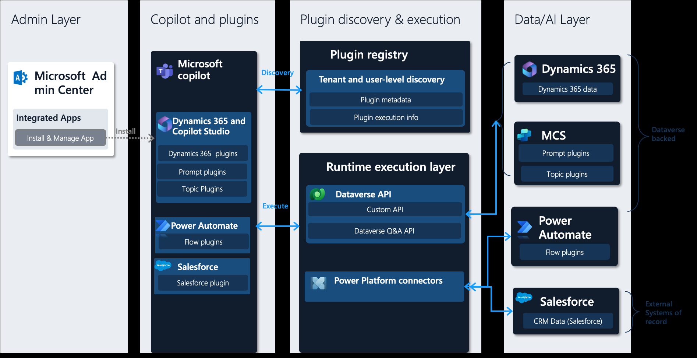
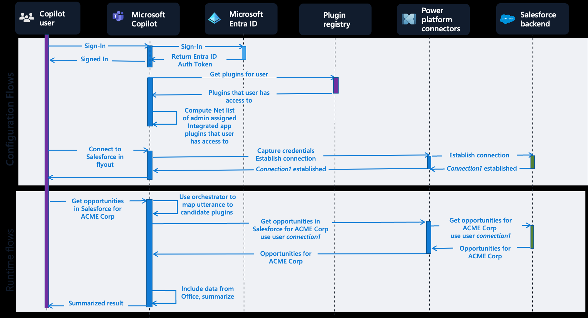

# Copilot-todo


Copilot Studio Plugin 을 ASP.NET API 로 구현하여 연결하는 예제
.NET 8.0 을 이용한 todo list 앱을 Azure Web App 에 배포하고, Open API를 swagger 로 노출하여 Power Platform 의 Custom Connector 에 API 를 추가하여 관리되는 API 서비스를 Copilot 에서 특정 토픽(intent) 으로 호출하여 Legacy 및 사용자 정의 로직을 실행하도록 구현된 예제

> [!Note]
> - 비지니스 도메인으로 나누어진 여러 API 는 API management 이용하여 API 관리 개선
> - 사용자의 발화문 또는 사용자 정보 상세는 Bot Framework 에 기반하므로 Activity, User, Channel 에 대한 시스템 변수 확인 필요
> - 사용자가 입력한 문장에서 일부분을 특정하기 위해서는 [엔티티](https://learn.microsoft.com/ko-kr/microsoft-copilot-studio/advanced-entities-slot-filling) 사용 또는 Prompt Engineering 필요


# Copilot Studio 플러그인 종류 및 구조


Power Virtual Agent 가 Copilot Studio 의 일부로 포함되면서 이름이 Copilot Studio 로 변경.
기존 Power virtual Agent(PVA) 는 커넥터를 통해 Power Automate 를 통해 다양한 작업 수행이 가능했으나 빌트인(Managed) 커텍터 이외 커스텀 커넥터, 봇 스킬등을 이용한 다양한 확장이 가능함.
- 텍스트 기반 No Code/Low Code 로 개발하기 위해서는 커스텀 커넥터 사용 권장
- 복잡한 시나리오 및 [스트리밍](https://github.com/dotnetpower/azfuncbot), 다양한 UI 등을 지원하기 위해서는 [Bot Skill](https://learn.microsoft.com/ko-kr/microsoft-copilot-studio/configuration-add-skills) 사용 권장

# Microsoft Copilot의 플러그인 구조와 Todo 플러그인의 위치

ASP.NET API 로 구현된 TodoApp 은 Azure Web App 에 배포시 Data/AI Layer 에 배포가 되고, Power Platform의 Dataverse API 에 등록이 되며 커스텀 커넥터의 속성에 AI 플러그인 레지스트리에 등록을 위한 기본 정보가 입력됨.
현재 기준으로 명시적 플러그인은 Copilot Studio Plugins, 파워플랫폼 커넥터를 통한 플러그인 방식이 존재 하며, OpenAI.com 에서 사용되는 yaml 형태의 플러그인 정의를 위해서는 API 정의 또는 코드에 API 정의를 상세하게 작성 필요.

OpenAI에서는 플러그인 정의에서 사용자 발화문이 전달이 되어야 하지만 Copilot Studio 에서는 토픽과 변수, 조건등을 지정해 미세한 조정을 통해 좀더 세부적인 정보를 추출/가공 가능

openai.com 에서 사용되는 [플러그인 정의](https://github.com/openai/plugins-quickstart/blob/main/openapi.yaml) 방식 예시
<details>
    <summary>openapi.yaml</summary>

```
openapi: 3.0.1
info:
  title: TODO Plugin
  description: A plugin that allows the user to create and manage a TODO list using ChatGPT. If you do not know the user's username, ask them first before making queries to the plugin. Otherwise, use the username "global".
  version: 'v1'
servers:
  - url: http://localhost:5003
paths:
  /todos/{username}:
    get:
      operationId: getTodos
      summary: Get the list of todos
      parameters:
      - in: path
        name: username
        schema:
            type: string
        required: true
        description: The name of the user.
      responses:
        "200":
          description: OK
          content:
            application/json:
              schema:
                $ref: '#/components/schemas/getTodosResponse'
    post:
      operationId: addTodo
      summary: Add a todo to the list
      parameters:
      - in: path
        name: username
        schema:
            type: string
        required: true
        description: The name of the user.
      requestBody:
        required: true
        content:
          application/json:
            schema:
              $ref: '#/components/schemas/addTodoRequest'
      responses:
        "200":
          description: OK
    delete:
      operationId: deleteTodo
      summary: Delete a todo from the list
      parameters:
      - in: path
        name: username
        schema:
            type: string
        required: true
        description: The name of the user.
      requestBody:
        required: true
        content:
          application/json:
            schema:
              $ref: '#/components/schemas/deleteTodoRequest'
      responses:
        "200":
          description: OK

components:
  schemas:
    getTodosResponse:
      type: object
      properties:
        todos:
          type: array
          items:
            type: string
          description: The list of todos.
    addTodoRequest:
      type: object
      required:
      - todo
      properties:
        todo:
          type: string
          description: The todo to add to the list.
          required: true
    deleteTodoRequest:
      type: object
      required:
      - todo_idx
      properties:
        todo_idx:
          type: integer
          description: The index of the todo to delete.
          required: true
```
</details>

## 빌트인 플러그인(Microsoft Copilot Studio 플러그인)과 커스텀 플러그인(커넥터 플러그인)의 차이
### Microsoft Copilot Studio 플러그인


대화 플러그인에서 [작업 호출]-[커넥터]-[MSN Weather] 와 같이 빌트인 플러그인을 추가 하여 사용하는 경우 트리거의 **대화 스타터** 에 예시 발화문 (예: 오늘 서울 날씨 알려줘) 을 통해 빌트인 플러그인이 호출됨

### 커넥터 플러그인


커스텀 커넥터를 통해 유사하게 등록이 될 수 있으며, 발화문이 5개로 제한적인 **대화 스타터** 보다 **토픽** 에서 다양한 예시문(한글 기준 20문장 이상)을 통해 해당 플러그인으로 유입 조정이 쉬움
**토픽** 은 의도(intent) 로써 예시문을 통해 [의도 인식](https://learn.microsoft.com/ko-kr/azure/ai-services/speech-service/intent-recognition)이 되며 하나의 Copilot 에 토픽이 많아질 수록 인식율이 낮아질 수 있음. 

"오늘 서울 날씨를 알려줘" 와 같이 특정한 의도에서 지역을 뜻하는 `서울` 과 같은 알려진 단어는 pre-built entity 에 등록이 되어 있지만 "보험 상품개발팀의 OOO의 연락처을 알려줘" 에서 `상품개발팀` 과 같이 특정 도메인에 한정된 단어의 경우 Copilot Studio 의 `엔티티` 에 등록을 하여 `의도 인식`과 함께 해당 엔티티 데이터가 포함되어 다음노드 에서 참조하기 용이함

## 플러그인으로써의 OpenAPI 
자연어를 통한 OpenAPI 를 호출하기 위해서는 하나의 함수가 하나의 플러그인 형태가 됨.

'할일추가', '할일목록', '할일완료' 를 구현하기 위해서는 3개의 플러그인이 등록이 되어야함.

## Copilot 이 플러그인을 호출하는 과정 상세 Youtube 영상(OpenAI Plugin Action 예시) 
[](https://youtu.be/pq34V_V5j18?t=1497)


## TodoApp 작성 및 배포를 위한 필수 환경
.net 8.0
vscode
vscode Azure Tools extension
git

코드 복사 및 vscode 로 열기
```
git clone https://github.com/dotnetpower/Copilot-todo.git

cd Copilot-todo

code .
```

## API 프로젝트 생성 및 swagger 구성
다음 링크를 참조 해서 완성된 코드가 ./TodoApi 에 있으며, vscode 에서 `F5` 로 실행 하거나 `dotnet run` 명령으로 실행하여 확인 가능
[Tutorial: Create a minimal API with ASP.NET Core](https://learn.microsoft.com/en-us/aspnet/core/tutorials/min-web-api?view=aspnetcore-8.0&tabs=visual-studio-code)


## Azure Web App 생성
azure web app 생성 후 해당 web app 에 배포
`F1` 키로 Command Palatte 열고 Deploy 로 검색해서 Deploy to Web App 선택하여 배포


## 배포 확인 
https://copilottodoapp1.azurewebsites.net/swagger/index.html


## Power Automate 사용자 지정커넥터 추가
https://make.powerautomate.com/

[더보기] - [모두 검색] 에서 **사용자 지정 커넥터** 선택


우측 상단의 [새 사용자 지정 커넥터] 선택


배포한 swagger defination 인 https://copilottodoapp1.azurewebsites.net/swagger/TodoAPI/swagger.json  를 파일로 저장하고 


저장된 파일 가져오기로 업로드.

> URL에서 OpenAPI 가져오기는 현재(2024.05) 기준 OAS2.0 까지만 지원하므로

예제로 작성된 Todo App 은 인증이 없으므로 **AI 플러그 인(프리뷰)** 으로 이동한 뒤 간단한 설명 추가


테스트를 위해서 **커넥터 만들기** 클릭 후 **테스트** 에서 PostTodoitems 선택 하고 `name`에 할일 입력


(결과 예시)


데이터 확인 - 작업 중 GetTodoitemsAll 을 선택하고 `테스트 작업` 클릭하여 데이터 확인


## Copilot Studio 에서 작업(Plugin Action) 추가
https://copilotstudio.microsoft.com/ 에서 Copilot 을 새로 만들거나 기존에 만들어둔 리소스에서 **작업(프리뷰) 추가**


플러그인 검색에서 이전에 만든 **사용자 지정커넥터** 이름으로 검색


할일추가를 위한 PostTodoitems 를 선택


### 작업을 연결하기 위한 토픽 생성


할일을 다시 입력받아도 되지만 한번에 받기 위해서 질문 단계를 삭제


노드 추가


> 이 단계에서 작업이 보이지 않으면 작업으로 이동해서 **이름** 설정이 정상적인지 확인필요.

값 설정에서 이름선택 


### 의도 인식 강화를 위해 문구 조정


저장 후 테스트


액션 결과 무시하려면 다음 체크 해제


### 인식 강화하기


인식이 잘 안되는 이유는 한글은 자소단위로 학습이 되기 때문에 유사한 패턴이 추가되어야 함.

토픽 > 할일추가 선택한 후 **문구 추가** 


# 사례 1 - 지능형 고객 센터
(Microsoft Copilot 으로 생성됨)

[1]: https://azure.microsoft.com/ko-kr/products/ai-services/openai-service ""
[2]: https://www.genesys.com/ko-kr/resources/five-stories-of-ai-in-customer-experience-an-asia-pacific-perspective ""
[3]: https://news.microsoft.com/ko-kr/2024/04/22/business_ai_transformation/ ""
[4]: https://learn.microsoft.com/ko-kr/azure/ai-services/openai/overview ""

**Azure OpenAI Service**는 고급 언어 AI 모델을 제공하는 서비스로, **Microsoft Azure**에서 활용할 수 있습니다. 이 서비스는 **OpenAI GPT-4**, **GPT-3**, **Codex**, **DALL-E**, **Whisper**, 그리고 **텍스트 음성 변환 모델**을 사용하여 다양한 사용 사례에 맞게 미세 조정할 수 있는 업계 최고의 코딩과 언어 AI를 제공합니다¹[1][1].

아래는 Azure OpenAI Service를 활용하여 고객 서비스를 혁신하고 있는 몇 가지 사례입니다:

1. **CarMax**:
   - CarMax는 AI 기반 도구를 사용하여 고객을 최우선으로 두고 있습니다. 생성형 AI를 활용하여 고객과의 상호작용을 개선하고 있으며, 고객 만족도와 직원 성과를 향상시키고 있습니다¹[1][1].

2. **AT&T**:
   - AT&T는 생성형 AI를 활용하여 운영 및 직원 환경을 개선하고 있습니다. AI 분석 기능, 프로세스, 도구를 조합하여 고객 서비스를 지원하고 있습니다²[2][2].

3. **KPMG**:
   - KPMG는 현재 기능을 보강하기 위해 생성형 AI를 활용하고 있습니다. AI 기술을 통해 비즈니스 프로세스를 최적화하고 있으며, 고객 경험을 개선하고 있습니다³[3][3].

4. **Mercedes-Benz**:
   - Mercedes-Benz는 차량 내 음성에 생성형 AI를 추가하여 고객 경험을 향상시키고 있습니다. 음성 기반 상호작용을 통해 고객과의 소통을 원활하게 하고 있습니다¹[1][1].

이러한 사례들은 Azure OpenAI Service를 활용하여 고객 서비스를 혁신하고 있으며, 미래에는 더 많은 기업들이 생성형 AI를 고객 센터에 도입할 것으로 기대됩니다! 😊


# 사례 2 - 콘텐츠 생성 및 고객 상담
(Microsoft Copilot 으로 생성됨)


[출처]: [콜 센터 데이터 추출 및 분석](https://learn.microsoft.com/ko-kr/azure/architecture/ai-ml/openai/architecture/call-center-openai-analytics)


## 메르세데스-벤츠(Mercedes-Benz)의 Azure OpenAI 서비스를 통한 차량 내 경험 개선

[메르세데스-벤츠는 Azure OpenAI 서비스를 활용하여 차량 내 경험을 혁신하고 있습니다. 2023년 6월 16일부터 미국 운전자들은 MBUX 음성 어시스턴트의 "Hey Mercedes" 기능을 더 직관적이고 대화식으로 사용할 수 있는 베타 프로그램에 참여할 수 있습니다](https://azure.microsoft.com/en-us/blog/mercedes-benz-enhances-drivers-experience-with-azure-openai-service/).

이 프로그램은 다음과 같은 향상된 기능을 제공합니다:

1. **강화된 음성 명령 및 상호작용**: ChatGPT를 통해 더 동적인 대화가 가능해집니다. 고객은 음성 명령을 이해하는 음성 어시스턴트뿐만 아니라 상호작용적인 대화를 할 수 있습니다.

2. **확장된 작업 기능**: 목적지 정보, 레시피, 복잡한 질문에 대한 종합적인 답변을 제공합니다. 이로써 운전자는 핸들을 잡고 도로를 주시하며 운전할 수 있습니다.

3. **문맥에 맞는 후속 질문**: 특정 명령이 필요한 일반적인 음성 어시스턴트와 달리, ChatGPT는 문맥을 유지하며 복잡한 질문이나 다중 대화를 처리할 수 있습니다. 운전자는 음성 어시스턴트로부터 자세하고 관련성 있는 답변을 받을 수 있습니다.

4. **제3자 서비스 통합**: 메르세데스-벤츠는 ChatGPT 플러그인 생태계를 탐색하고 있습니다. 이를 통해 운전자는 자연어 명령을 사용하여 레스토랑 예약, 영화 티켓 예매 등과 같은 작업을 수행할 수 있으며, 도로에서의 편의성과 생산성을 더욱 향상시킬 수 있습니다

이러한 기능들은 운전자들의 차량 경험을 혁신적으로 개선하고 있으며, Azure OpenAI 서비스를 통해 메르세데스-벤츠는 최첨단 AI 모델을 활용하고 있습니다

참고 출처:
    1. Mercedes-Benz Enhances Driver's Experience with Azure OpenAI Service
    2. Argon Systems - Mercedes-Benz Enhances Driver's Experience with Azure OpenAI Service
    3. 4TechViews - Mercedes-Benz Enhances Driver's Experience with Azure OpenAI Service
    4. [Microsoft Tech Community - Mercedes-Benz Enhances Driver's Experience with Azure OpenAI](https://techcommunity.microsoft.com/t5/azure-partner-community/mercedes-benz-enhances-drivers-experience-with-azure-openai/td-p/3857778)


# 사례 3 - 지식 마이닝
(Microsoft Copilot 으로 생성됨)

[31]: https://www.microsoft.com/ko-kr/ai/ai-customer-stories ""
[32]: https://www.cloocus.com/general-availability-of-azure-openai-service-expands-access-to-large-advanced-ai-models-with-added-enterprise-benefits/ ""
[33]: https://learn.microsoft.com/ko-kr/azure/architecture/ai-ml/openai/architecture/call-center-openai-analytics ""
[34]: https://azure.microsoft.com/ko-kr/solutions/knowledge-mining/ ""

물론입니다! **Azure AI**를 사용하여 **지식 마이닝**을 구현한 몇 가지 고객 사례를 한글로 정리해 드리겠습니다:

1. **INSPIRE Environmental**: Azure AI를 활용하여 복잡한 해양 데이터 분석을 간소화하고 비용, 처리 시간 및 인력을 크게 줄였습니다¹[31].
2. **Lexmark**: Azure AI를 통해 여러 파트너 범주에 엔터프라이즈 서비스를 제공하고 계약 및 반복 수익을 늘렸습니다¹[31].
3. **Mercy**: Azure AI 솔루션을 사용하여 작업을 자동화하고 시간을 절약하며 운영 비용을 절감했습니다¹[31].
4. **John Hancock**: Azure AI Bot Service를 활용하여 고객 지원 전화를 줄임으로써 비용 절감을 실현하고 규모를 확장했습니다¹[31].
5. **Netlogic**: 생성된 회의 요약과 커뮤니케이션을 사용하여 생산성 문제를 극복하고 수익을 증대했습니다¹[31].
6. **NC Fusion**: Dynamics 365 Customer Insights의 Copilot을 사용하여 수천 명의 가족에게 도달하는 광고 캠페인을 위한 커뮤니케이션을 신속하게 만들었습니다¹[31].
7. **Atera**: Azure AI 서비스를 활용하여 IT 관리 플랫폼을 개선하고 고객 서비스를 개선했습니다¹[31].
8. **Aprimo**: Azure OpenAI Service와 ChatGPT를 사용하여 마케터에게 확장 가능한 향상된 자동화를 제공하는 임베디드 생성형 AI 어시스턴트를 만들었습니다²[32].
9. **AT&T**: Azure OpenAI Service를 사용하여 비즈니스 운영을 자동화하고 간소화함으로써 시간 및 비용 절감 그리고 가치를 제공했습니다¹[31].
10. **Project Gutenberg**: AI가 생성한 책 내레이션을 사용하여 시각 장애인을 포함한 전 세계 커뮤니티에 약 5,000권의 무료 오디오북을 제공했습니다¹[31].

이러한 사례들은 Azure AI와 OpenAI 서비스를 통해 다양한 분야에서 지식 마이닝을 성공적으로 구현한 것입니다.¹[31] ²[32] 더 많은 정보를 원하시면 [Microsoft AI 고객 사례 페이지](https://www.microsoft.com/ko-kr/ai/ai-customer-stories)를 참조하시기 바랍니다³[34].

출처: Bing과의 대화, 2024. 5. 2.
1. AI 고객 사례 | Microsoft AI. https://www.microsoft.com/ko-kr/ai/ai-customer-stories.
2. Azure OpenAI 서비스를 통해 ChatGPT에 액세스하세요 - 클루커스. https://www.cloocus.com/general-availability-of-azure-openai-service-expands-access-to-large-advanced-ai-models-with-added-enterprise-benefits/.
3. 정보 마이닝 | Microsoft Azure. https://azure.microsoft.com/ko-kr/solutions/knowledge-mining/.
4. Azure OpenAI 서비스, Speech Services 및 언어 서비스를 사용하여 콜 .... https://learn.microsoft.com/ko-kr/azure/architecture/ai-ml/openai/architecture/call-center-openai-analytics.


# 참고
- [Microsoft Copilot Studio 플러그인 아키텍처](https://learn.microsoft.com/ko-kr/microsoft-copilot-studio/copilot-plugins-architecture)
