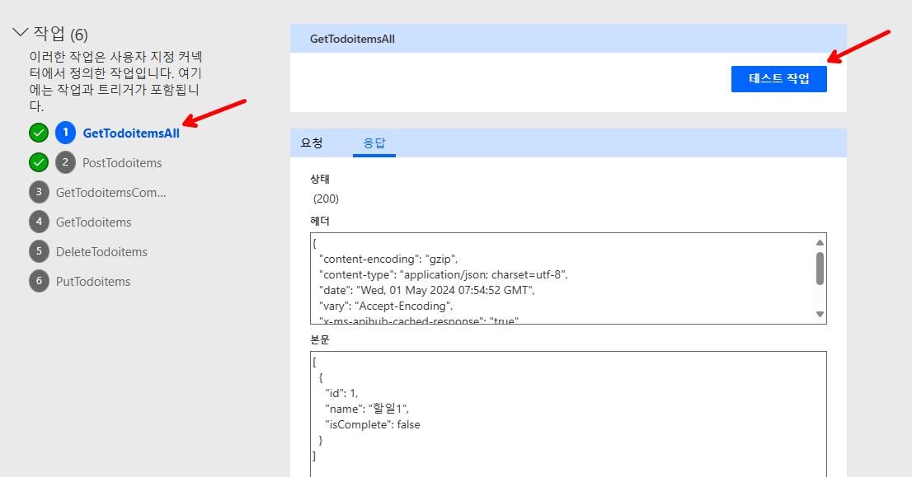
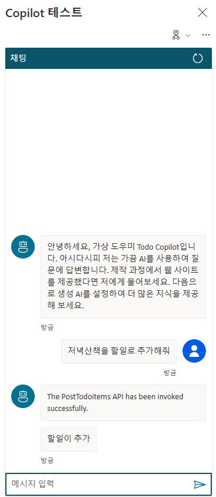

# Copilot-todo
Copilot Studio Plugin 을 ASP.NET API 로 구현하여 연결하는 예제
.NET 8.0 을 이용한 todo list 앱을 Azure Web App 에 배포하고, Open API를 swagger 로 노출하여 Power Platform 의 Custom Connector 에 API 를 추가하여 관리되는 API 서비스를 Copilot 에서 특정 토픽(intent) 으로 호출하여 Legacy 및 사용자 정의 로직을 실행하도록 구현된 예제

> [!Note]
> 비지니스 도메인으로 나누어진 여러 API 는 API management 이용하여 API 관리 개선

> 사용자의 발화문 또는 사용자 정보 상세는 Bot Framework 에 기반하므로 Activity, User, Channel 에 대한 시스템 변수 확인 필요

> 사용자가 입력한 문장에서 일부분을 특정하기 위해서는 Prompt Engineering 필요 


# Copilot Studio 플러그인 구조


Power Virtual Agent 가 Copilot Studio 의 일부로 포함되면서 이름이 Copilot Studio 로 변경.
기존 Power virtual Agent(PVA) 는 커넥터를 통해 Power Automate 를 통해 다양한 작업 수행이 가능했으나 빌트인(Managed) 커텍터 이외 커스텀 커넥터, 봇 스킬등을 이용한 다양한 확장이 가능함.

## 필수 환경
.net 8.0
vscode
vscode Azure Tools extension
git

코드 복사 및 vscode 로 열기
```
git clone https://github.com/dotnetpower/Copilot-todo.git

cd Copilot-todo

code .
```

## API 프로젝트 생성 및 swagger 구성
다음 링크를 참조 해서 완성된 코드가 ./TodoApi 에 있으며, vscode 에서 `F5` 로 실행 하거나 `dotnet run` 명령으로 실행하여 확인 가능
[Tutorial: Create a minimal API with ASP.NET Core](https://learn.microsoft.com/en-us/aspnet/core/tutorials/min-web-api?view=aspnetcore-8.0&tabs=visual-studio-code)


## Azure Web App 생성
azure web app 생성 후 해당 web app 에 배포
`F1` 키로 Command Palatte 열고 Deploy 로 검색해서 Deploy to Web App 선택하여 배포


## 배포 확인 
https://copilottodoapp1.azurewebsites.net/swagger/index.html


## Power Automate 사용자 지정커넥터 추가
https://make.powerautomate.com/

[더보기] - [모두 검색] 에서 **사용자 지정 커넥터** 선택


우측 상단의 [새 사용자 지정 커넥터] 선택


배포한 swagger defination 인 https://copilottodoapp1.azurewebsites.net/swagger/TodoAPI/swagger.json  를 파일로 저장하고 


저장된 파일 가져오기로 업로드.

> URL에서 OpenAPI 가져오기는 현재(2024.05) 기준 OAS2.0 까지만 지원하므로

예제로 작성된 Todo App 은 인증이 없으므로 **AI 플러그 인(프리뷰)** 으로 이동한 뒤 간단한 설명 추가


테스트를 위해서 **커넥터 만들기** 클릭 후 **테스트** 에서 PostTodoitems 선택 하고 `name`에 할일 입력


(결과 예시)


데이터 확인 - 작업 중 GetTodoitemsAll 을 선택하고 `테스트 작업` 클릭하여 데이터 확인



## Copilot Studio 에서 작업(Plugin Action) 추가
https://copilotstudio.microsoft.com/ 에서 Copilot 을 새로 만들거나 기존에 만들어둔 리소스에서 **작업(프리뷰) 추가**


플러그인 검색에서 이전에 만든 **사용자 지정커넥터** 이름으로 검색


할일추가를 위한 PostTodoitems 를 선택


### 작업을 연결하기 위한 토픽 생성


할일을 다시 입력받아도 되지만 한번에 받기 위해서 질문 단계를 삭제


노드 추가


> 이 단계에서 작업이 보이지 않으면 작업으로 이동해서 **이름** 설정이 정상적인지 확인필요.

값 설정에서 이름선택 


### 의도 인식 강화를 위해 문구 조정


저장 후 테스트



액션 결과 무시하려면 다음 체크 해제


### 인식 강화하기


인식이 잘 안되는 이유는 한글은 자소단위로 학습이 되기 때문에 유사한 패턴이 추가되어야 함.

토픽 > 할일추가 선택한 후 **문구 추가** 


## 참고

# 사례 1 - 지능형 고객 센터
(Microsoft Copilot 으로 생성됨)

[1]: https://azure.microsoft.com/ko-kr/products/ai-services/openai-service ""
[2]: https://www.genesys.com/ko-kr/resources/five-stories-of-ai-in-customer-experience-an-asia-pacific-perspective ""
[3]: https://news.microsoft.com/ko-kr/2024/04/22/business_ai_transformation/ ""
[4]: https://learn.microsoft.com/ko-kr/azure/ai-services/openai/overview ""

**Azure OpenAI Service**는 고급 언어 AI 모델을 제공하는 서비스로, **Microsoft Azure**에서 활용할 수 있습니다. 이 서비스는 **OpenAI GPT-4**, **GPT-3**, **Codex**, **DALL-E**, **Whisper**, 그리고 **텍스트 음성 변환 모델**을 사용하여 다양한 사용 사례에 맞게 미세 조정할 수 있는 업계 최고의 코딩과 언어 AI를 제공합니다¹[1][1].

아래는 Azure OpenAI Service를 활용하여 고객 서비스를 혁신하고 있는 몇 가지 사례입니다:

1. **CarMax**:
   - CarMax는 AI 기반 도구를 사용하여 고객을 최우선으로 두고 있습니다. 생성형 AI를 활용하여 고객과의 상호작용을 개선하고 있으며, 고객 만족도와 직원 성과를 향상시키고 있습니다¹[1][1].

2. **AT&T**:
   - AT&T는 생성형 AI를 활용하여 운영 및 직원 환경을 개선하고 있습니다. AI 분석 기능, 프로세스, 도구를 조합하여 고객 서비스를 지원하고 있습니다²[2][2].

3. **KPMG**:
   - KPMG는 현재 기능을 보강하기 위해 생성형 AI를 활용하고 있습니다. AI 기술을 통해 비즈니스 프로세스를 최적화하고 있으며, 고객 경험을 개선하고 있습니다³[3][3].

4. **Mercedes-Benz**:
   - Mercedes-Benz는 차량 내 음성에 생성형 AI를 추가하여 고객 경험을 향상시키고 있습니다. 음성 기반 상호작용을 통해 고객과의 소통을 원활하게 하고 있습니다¹[1][1].

이러한 사례들은 Azure OpenAI Service를 활용하여 고객 서비스를 혁신하고 있으며, 미래에는 더 많은 기업들이 생성형 AI를 고객 센터에 도입할 것으로 기대됩니다! 😊

[1]: https://azure.microsoft.com/ko-kr/products/ai-services/openai-service
[2]: https://www.genesys.com/ko-kr/resources/five-stories-of-ai-in-customer-experience-an-asia-pacific-perspective
[3]: https://news.microsoft.com/ko-kr/2024/04/22/business_ai_transformation/


# 사례 2 - 콘텐츠 생성 및 고객 상담
(Microsoft Copilot 으로 생성됨)


[출처]: [콜 센터 데이터 추출 및 분석](https://learn.microsoft.com/ko-kr/azure/architecture/ai-ml/openai/architecture/call-center-openai-analytics)

[1]: https://m.blog.naver.com/jooeun0502/221956294941 ""
[2]: https://bing.com/search?q=%EC%9C%84%EB%82%B4%EC%9A%A9%EC%9D%84+github+%EC%9D%98+md+%ED%8C%8C%EC%9D%BC%EB%A1%9C+%EC%9E%91%EC%84%B1%ED%95%98%EB%8A%94+%EB%B0%A9%EB%B2%95 ""
[3]: https://wooni-research.tistory.com/entry/%EA%B9%83%ED%97%88%EB%B8%8C-Github-%EA%B3%B5%EB%B6%80%ED%95%98%EA%B8%B0-8-%EC%86%8C%EA%B0%9C%EA%B8%80-READMEmd-%ED%8C%8C%EC%9D%BC-%EC%9E%91%EC%84%B1%ED%95%98%EA%B8%B0 ""
[4]: https://blog.naver.com/PostView.nhn?blogId=ycpiglet&logNo=222307838439 ""
[5]: https://blog.naver.com/PostView.naver?blogId=jooeun0502&logNo=221956294941&directAccess=false ""
[6]: https://gist.github.com/ihoneymon/652be052a0727ad59601 ""
[7]: https://bing.com/search?q=github+md+%ED%8C%8C%EC%9D%BC+%EC%9E%91%EC%84%B1+%EB%B0%A9%EB%B2%95 ""
[8]: https://backendcode.tistory.com/165 ""
[9]: https://coding-factory.tistory.com/620 ""


## 메르세데스-벤츠(Mercedes-Benz)의 Azure OpenAI 서비스를 통한 차량 내 경험 개선

[메르세데스-벤츠는 Azure OpenAI 서비스를 활용하여 차량 내 경험을 혁신하고 있습니다. 2023년 6월 16일부터 미국 운전자들은 MBUX 음성 어시스턴트의 "Hey Mercedes" 기능을 더 직관적이고 대화식으로 사용할 수 있는 베타 프로그램에 참여할 수 있습니다](https://azure.microsoft.com/en-us/blog/mercedes-benz-enhances-drivers-experience-with-azure-openai-service/).

이 프로그램은 다음과 같은 향상된 기능을 제공합니다:

1. **강화된 음성 명령 및 상호작용**: ChatGPT를 통해 더 동적인 대화가 가능해집니다. 고객은 음성 명령을 이해하는 음성 어시스턴트뿐만 아니라 상호작용적인 대화를 할 수 있습니다.

2. **확장된 작업 기능**: 목적지 정보, 레시피, 복잡한 질문에 대한 종합적인 답변을 제공합니다. 이로써 운전자는 핸들을 잡고 도로를 주시하며 운전할 수 있습니다.

3. **문맥에 맞는 후속 질문**: 특정 명령이 필요한 일반적인 음성 어시스턴트와 달리, ChatGPT는 문맥을 유지하며 복잡한 질문이나 다중 대화를 처리할 수 있습니다. 운전자는 음성 어시스턴트로부터 자세하고 관련성 있는 답변을 받을 수 있습니다.

4. **제3자 서비스 통합**: 메르세데스-벤츠는 ChatGPT 플러그인 생태계를 탐색하고 있습니다. 이를 통해 운전자는 자연어 명령을 사용하여 레스토랑 예약, 영화 티켓 예매 등과 같은 작업을 수행할 수 있으며, 도로에서의 편의성과 생산성을 더욱 향상시킬 수 있습니다¹[1].

이러한 기능들은 운전자들의 차량 경험을 혁신적으로 개선하고 있으며, Azure OpenAI 서비스를 통해 메르세데스-벤츠는 최첨단 AI 모델을 활용하고 있습니다²[2]³[3]⁴[4].

참고 출처:
1. Mercedes-Benz Enhances Driver's Experience with Azure OpenAI Service
2. Argon Systems - Mercedes-Benz Enhances Driver's Experience with Azure OpenAI Service
3. 4TechViews - Mercedes-Benz Enhances Driver's Experience with Azure OpenAI Service
4. [Microsoft Tech Community - Mercedes-Benz Enhances Driver's Experience with Azure OpenAI](https://techcommunity.microsoft.com/t5/azure-partner-community/mercedes-benz-enhances-drivers-experience-with-azure-openai/td-p/3857778)


# 사례 3 - 지식 마이닝
(Microsoft Copilot 으로 생성됨)

TBD

